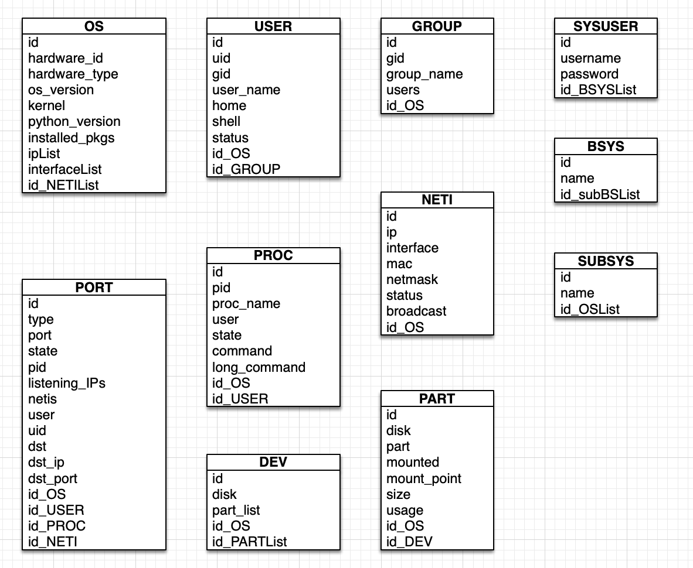

# CMDB Backend

## The data structure of CMDB data collector

### Data Structor

### CI Types

#### Update by scripts

|CI Type|Comment|ID|Related|
|:-:|:-:|:-:|:-:|
|OS|OS Info|id|NETI_ID|
|USER|USER Info|id|OS_ID|
|GROUP|GROUP Info|id|OS_ID, USER_ID|
|PORT|PORT Info|id|OS_ID, NETI_ID|
|PROC|PROCESS Info|id|OS_ID, PORT_ID, USER_ID|
|NETI|NET Interface Info|id|OS_ID|
|DEV|DEVICE Info|id|OS_ID|
|PART|PARTITION Info|id|OS_ID, DEV_ID|

#### Update by people

|CI Type|Comment|ID|Related|
|:-:|:-:|:-:|:-:|
|SYSUSER|SYSUSER Info|id|SYSUSER_ID|
|BSYS|BSYS Info|id|BSYS_ID|
|SUBSYS|SUBSYS Info|id|OS_ID, BSYS_ID|

### OS TYPE

|Item|Command|Sample|Comment|Related|
|:-:|:-:|:-:|:-:|:-:|
|id|cat /sys/devices/virtual/dmi/id/product_uuid \| sed -e 's/-//g' -e 's/^/OS-/'|OS-a170790ce6a6fc782db058324a912dac|OS_ID|||
|hardware_id|cat /sys/devices/virtual/dmi/id/product_uuid|a170790ce6a6fc782db058324a912dac||||
|hardware_type|dmidecode -s system-product-name|Hardware\|Docker\|VMWare|if is hardware or vmware, can get from command, if not can get from the docker server by docker ps -a(There's a CONTAINER_ID here)||
|os_type|cat /proc/version|Ubuntu\|CentOS|read the file or fetch it from ansible||
|kernel|uname -r|4.12.0-42-generic|read the file or fetch it from ansible||
|python_version|python -V|Python 3.6.0|run command||
|installed_pkgs|rpm -qa\|dpkg -l|a long list|run command||
|ipList|ifconfig -a\|ip addr list|1.1.1.1|run command||
|interfaceList|ifconfig -a\|ip addr list|en9|run command||
|id_NETIList|NETI-${ip}-interface, NETI-${ip}-interface|NETI-1.1.1.1-en9, NETI-1.1.1.2-en10|Related to NETI|NETI_ID|

### USER TYPE

|Item|Command|Sample|Comment|Related|
|:-:|:-:|:-:|:-:|:-:|
|id|USER-${OS_ID}-uid|USER-a170790ce6a6fc782db058324a912dac-0|USER_ID|OS_ID|
|uid|cat /etc/passwd|0|read file||
|gid|cat /etc/passwd|0|read file||
|user_name|cat /etc/passwd|root|read file||
|home|cat /etc/passwd|/root|read file||
|shell|cat /etc/passwd|/bin/bash|read file||
|status|cat /etc/shadow|True|read file||
|id_OS|OS-${OS_ID}|OS-a170790ce6a6fc782db058324a912dac|Related to OS_ID|OS_ID|
|id_GROUP|cat /etc/passwd|GROUP-a170790ce6a6fc782db058324a912dac-0|Related to GROUP_ID|GROUP_ID|

### GROUP TYPE

|Item|Command|Sample|Comment|Related|
|:-:|:-:|:-:|:-:|:-:|
|id|GROUP-${OS_ID}-gid|GROUP-a170790ce6a6fc782db058324a912dac-0|GROUP_ID|OS_ID|
|gid|cat /etc/group|0|read file||
|group_name|cat /etc/group|root|read file||
|users|cat /etc/group|root|read file||
|id_OS|OS-${OS_ID}|OS-a170790ce6a6fc782db058324a912dac|Related to OS_ID|OS_ID|

### PORT TYPE

|Item|Command|Sample|Comment|Related|
|:-:|:-:|:-:|:-:|:-:|
|id|PORT-TCP\|UDP-${OS_ID}-port|PORT-TCP-a170790ce6a6fc782db058324a912dac-22|PORT_ID|OS_ID|
|type|lsof -i -n -P\|netstat -luntp|TCP\|UDP|run command, different command between hardware os and docker||
|port|lsof -i -n -P\|netstat -luntp|22|run command, different command between hardware os and docker||
|state|lsof -i -n -P\|netstat -luntp|LISTENING\|ESTABLISHED|run command, different command between hardware os and docker||
|pid|lsof -i -n -P|4679|run command, still not find a best way to docker host||
|listening_IPs|lsof -i -n -P\|netstat -luntp|1.1.1.1, 2.2.2.2|need to match with $(ifconfig -a \| ip addr list)||
|netis|ifconfig -a \| ip addr list|en9, en10|run command||
|user|lsof -i -n -P|root|run command, still not find a best way to docker host||
|uid|cat /etc/passwd|0|read file||
|dst|lsof -i -n -P|1.1.1.2:3306|if the state is ESTABLISHED need to get this data, a connection to another server||
|dst_ip|lsof -i -n -P|1.1.1.2|if the state is ESTABLISHED need to get this data, a connection to another server(can query from the NETI)||
|dst_port|lsof -i -n -P|3306|if the state is ESTABLISHED need to get this data, a connection to another server||
|id_OS|OS-${OS_ID}|OS-a170790ce6a6fc782db058324a912dac|Related to OS_ID|OS_ID|
|id_USER|USER-${OS_ID}-uid|USER-a170790ce6a6fc782db058324a912dac-0|Related to USER_ID|USER_ID|
|id_PROC|PROC-${OS_ID}-pid|PROC-a170790ce6a6fc782db058324a912dac-4679|Related to PROC_ID|PROC_ID|
|id_NETI|NETI-${ip}-interface|NETI-${ip}-en9, NETI-${OS_ID}-en10|each item is related to a NETI_ID|NETI_ID|

### PROC TYPE

|Item|Command|Sample|Comment|Related|
|:-:|:-:|:-:|:-:|:-:|
|id|PROC-${OS_ID}-pid|PROC-a170790ce6a6fc782db058324a912dac-4679|PROC_ID|OS_ID|
|pid|ps -elf|4679|run command||
|proc_name|ps -elf|sshd|run command||
|user|ps -elf|root|run command||
|state|ps -elf|S|run command||
|command|ps -elf|/usr/sbin/sshd -D|run command||
|long_command|ps ewww -p ${pid}|/usr/sbin/sshd -D LANG=en_US.UTF-8 PATH=/usr/local/sbin:/usr/local/bin:/usr/sbin:/usr/bin:/sbin:/bin NOTIFY_SOCKET=/run/systemd/notify INVOCATION_ID=32fc790ce6a6fc782dcw48324a912dwb JOURNAL_STREAM=2:3293 SSHD_OPTS=|run command||
|id_OS|OS-${OS_ID}|OS-a170790ce6a6fc782db058324a912dac|Related to OS_ID|OS_ID|
|id_USER|USER-${OS_ID}-uid|USER-a170790ce6a6fc782db058324a912dac-0|USER_ID|USER_ID|

### NETINTERFACE TYPE

|Item|Command|Sample|Comment|Related|
|:-:|:-:|:-:|:-:|:-:|
|id|NETI-${ip}-interface|NET-${ip}-en9|NETI_ID||
|ip|ifconfig -a \| ip addr list|1.1.1.1|run command||
|interface|ifconfig -a \| ip addr list|en9|run command||
|mac|ifconfig -a \| ip addr list|00:00:00:00:00:00|run command||
|netmask|ifconfig -a \| ip addr list|255.255.255.0|run command||
|status|ifconfig -a \| ip addr list|UP\|DOWN|run command||
|broadcast|ifconfig -a \| ip addr list|1.1.1.255|run command||
|id_OS|OS-${OS_ID}|OS-a170790ce6a6fc782db058324a912dac|Related to OS_ID|OS_ID|

### DEVICE TYPE

|Item|Command|Sample|Comment|Related|
|:-:|:-:|:-:|:-:|:-:|
|id|DEV-${OS_ID}-disk|DEV-${OS_ID}-sdd|DEV_ID|OS_ID|
|disk|fdisk -l|sdd|run command||
|part_list|fdisk -l|sdd1, sdd2|run command||
|id_OS|OS-${OS_ID}|OS-a170790ce6a6fc782db058324a912dac|Related to OS_ID|OS_ID|
|id_PARTList|PART-${OS_ID}-part|PART-a170790ce6a6fc782db058324a912dac-sdd1, PART-a170790ce6a6fc782db058324a912dac-sdd2|Related to each PART_ID|PART_ID|

### PART TYPE

|Item|Command|Sample|Comment|Related|
|:-:|:-:|:-:|:-:|:-:|
|id|PART-${OS_ID}-part|PART-${OS_ID}-sdd1|PART_ID|OS_ID|
|disk|fdisk -l|sdd|run command||
|part|fdisk -l|sdd1|run command||
|mounted|mount|True\|False|run command||
|mount_point|mount|/tmp/ttt|run command||
|size|df -h|10G|run command||
|usage|df -h|10%|run command||
|id_OS|OS-${OS_ID}|OS-a170790ce6a6fc782db058324a912dac|Related to OS_ID|OS_ID|
|id|DEV-${OS_ID}-disk|DEV-${OS_ID}-sdd|DEV_ID|OS_ID|

### SYSUSER TYPE

|Item|Command|Sample|Comment|Related|
|:-:|:-:|:-:|:-:|:-:|
|id||00000001|SYSUSER_ID||
|user_name||admin|||
|password||xxxxxx|||
|id_BSYSList||00000001, 00000002|||

### BSYS TYPE

|Item|Command|Sample|Comment|Related|
|:-:|:-:|:-:|:-:|:-:|
|id||00000001|BSYS_ID||
|name||admin|||
|id_SUBBSYSList||nginx, tomcat|||

### SUBBSYS TYPE

|Item|Command|Sample|Comment|Related|
|:-:|:-:|:-:|:-:|:-:|
|id||00000001|SUBSYS_ID||
|name||admin|||
|id_OSList||OS-a170790ce6a6fc782db058324a912dac, OS-a170790ce6a6fc782db058324a912232|||

## Ansible

- I just write a Dockerfile and boot script in `ansible/`. You can read the README.md file, and boot it.
- In the next steps, I will use ansible to deploy and run some scripts, to get data, and push them to a Queue.
